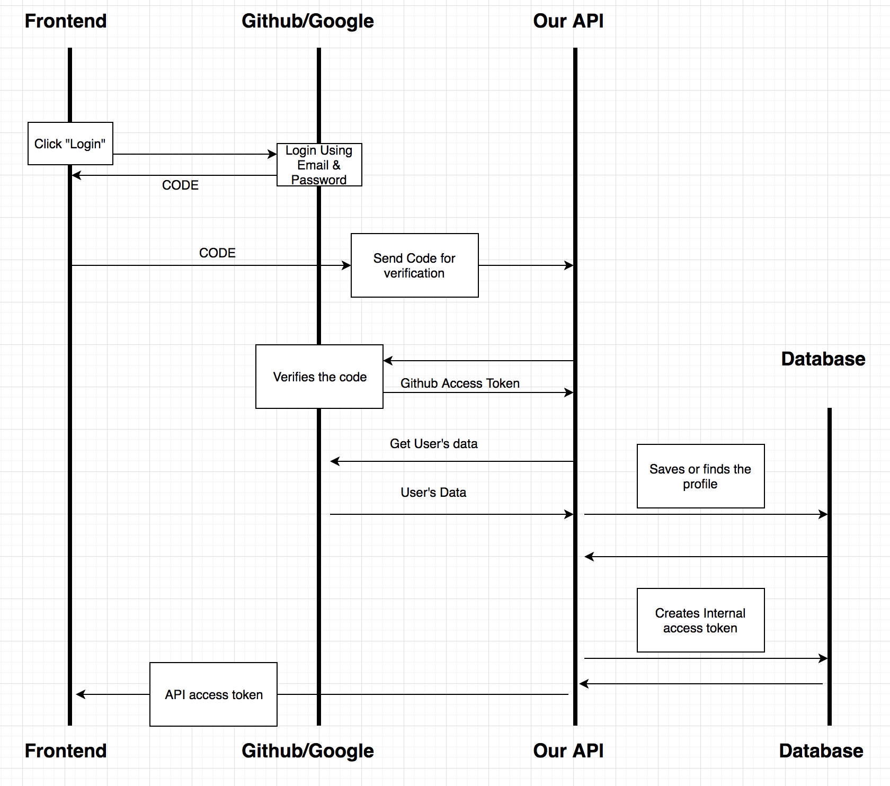

# Oauth Flow explained
## Why to use the OAuth Flow
Basically, when users want to access private data, you need to check if they are real, and OAuth, is a method to do it.

If you want to check realness of the user, you can allow him to register or login for example by using standard form with email and password. Next you probably should create an account for this user,  send a confirmation email and after user clicks on the link in the email you can confirm they are real.

If you want to check realness of the user, you can allow him to register or login, for example, by using a standard form with email and password. Next, you probably should create an account for this user, send him a confirmation email and after the user clicks on the link in the email you can confirm she is real.

After all that, you can allow your users to create articles, write comments, and access other resources accessible only for logged in users.

But sometimes you don’t want to have this standard form. Maybe because of legal reasons you can’t store emails in your database, you know, keeping it safe is very expensive?

Maybe you just want to have simpler solution for your users, to give them instant access without checking their emails?

Here is where OAuth flow comes in.

On the internet, you can find several big companies which have millions of registed users. Most of people have account on, facebook, google or twitter or if you are developer, on github so why not use these companies to verify users for you?

If someone wants to register to your service, and you don’t want to store private data, you can ask other social media company to verify this user for you. In our project, it’s a github because most of developers have github account, but it doesn’t matter which service you use - you can choose several, if you want to.

# The authentication flow
Let’s check out the workflow. How can the user login using external service? You could ask the user who tries to login using github account to give her username and password to you but that's wrong. Nobody wants to share passwords.

In this flow, your rails application has login and password, so it becomes this user and it can do everything the original user could. For example, manage repositories and organizations or even remove the account. No one wants that.

So the solution is to allow rails application to create the github application that acts as user you want to login, but with limited access! For example - if the user logs in using this github application, he'll only be able to read data, not modify anything.

Here is the simplified workflow: 

We'll need a User or frontend application, github app and rails API application.

Frontend logs in or registers account on github and asks for a unique code

It’s like frontend saying: “Hey Github, give me something that I can share with others so if they show it to you, you’ll know that’s me.

Github responses with like: ok, here is the temporary code

Next frontend shares the code, with API, calling: API, I’m a real user, you can check it out.

From API perspective this code means nothing, so they forward it to Github for verification.

And github responses: This user is real, we have him in our database, his name's John Smith. This code allows to access only public data. I’ll send you a token you can use to act as this user. - Thanks! So please give me a username, full name, id, and avatar url, so I can show this profile on my page.

And that’s it. An OAuth flow.

# Summary
From API perspective the User vs Github App communication is irrelevant. We only bother with Github vs API communication. We start from accepting the code, either good or wrong, and we end up with receiving the token and sending it back to the frontend.

In the next lessons we’ll implement it but first we need to create a github application to get client_id and client_secret, so we will be able to communicate with Github from our API.

During the next lessons we'll implement it but first we need to create the github application. Let me take a quick break and see you in a moment.